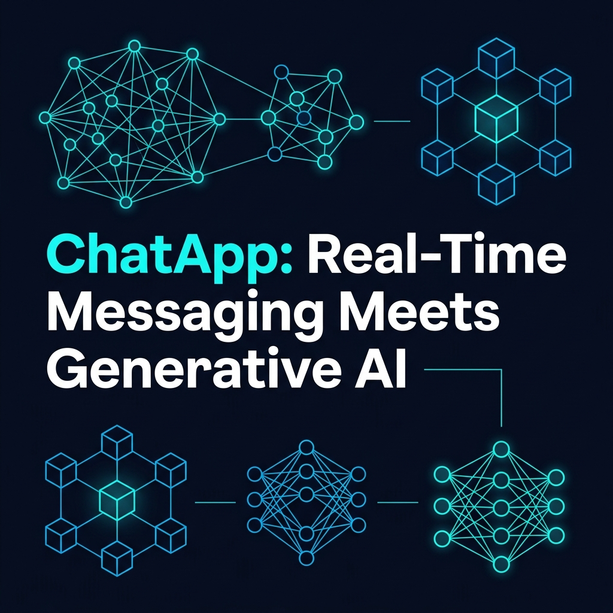
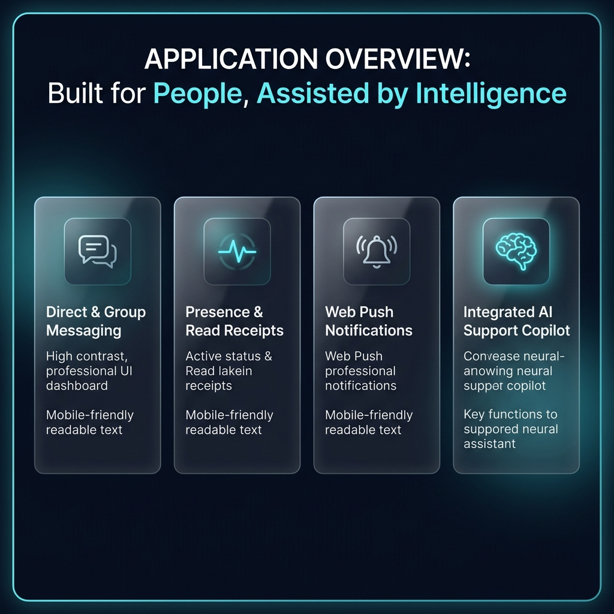
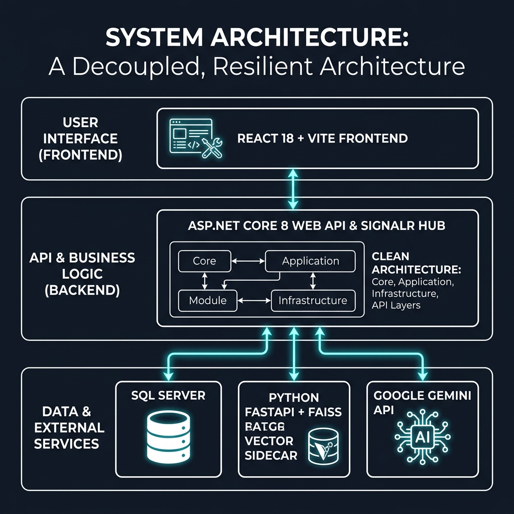
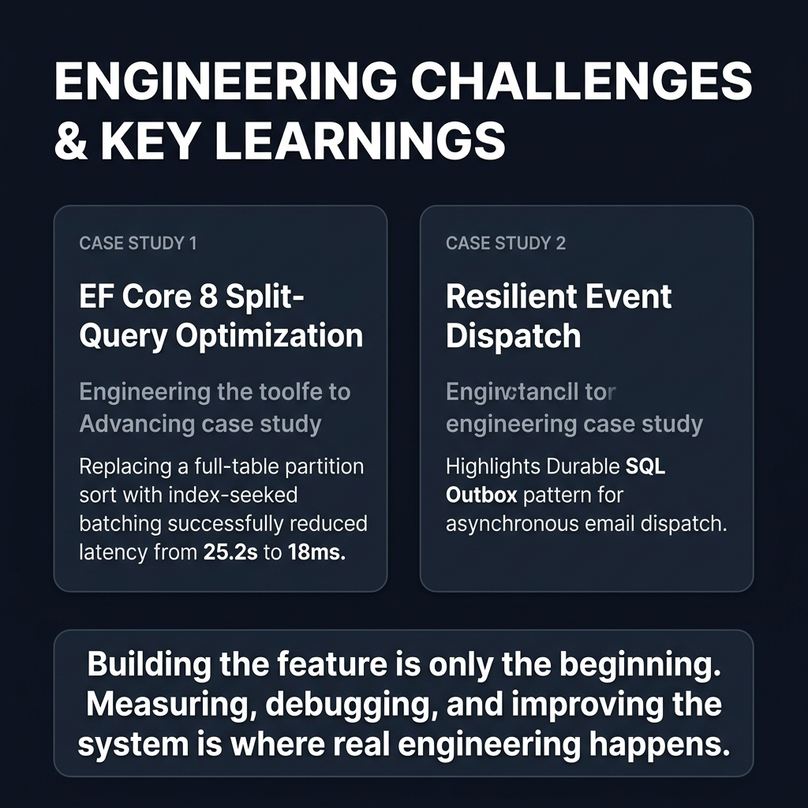
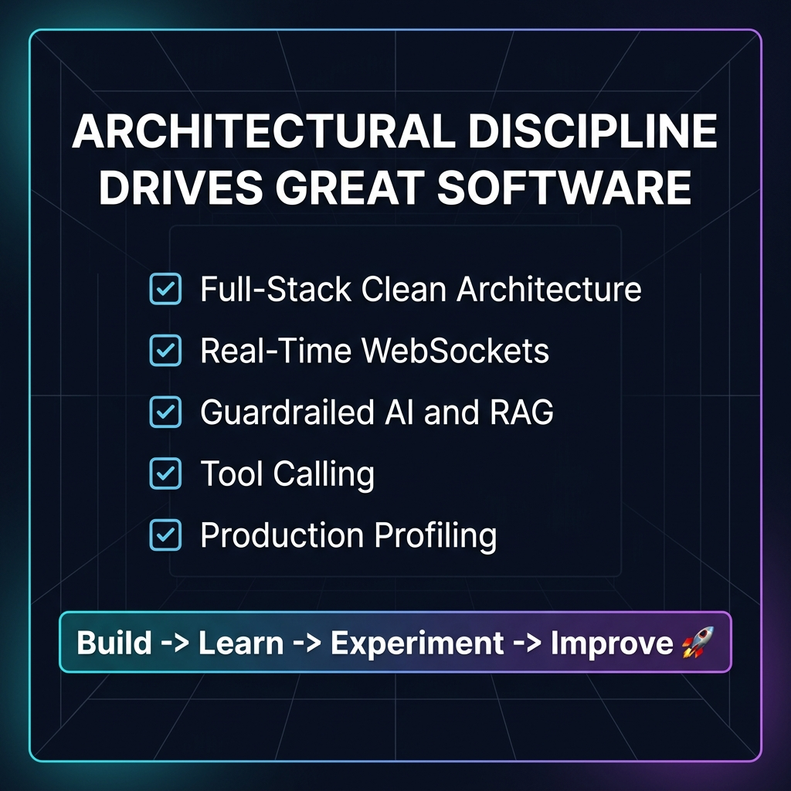
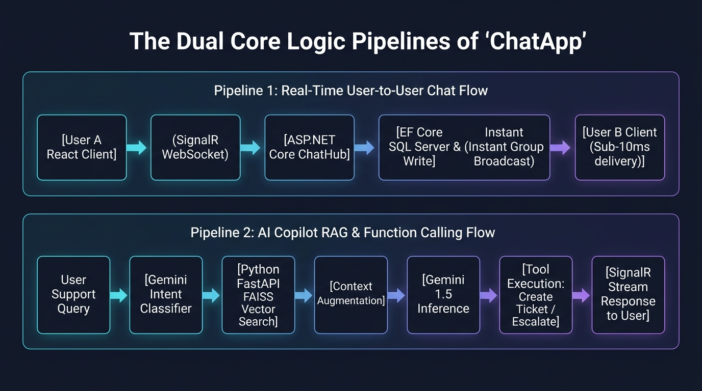
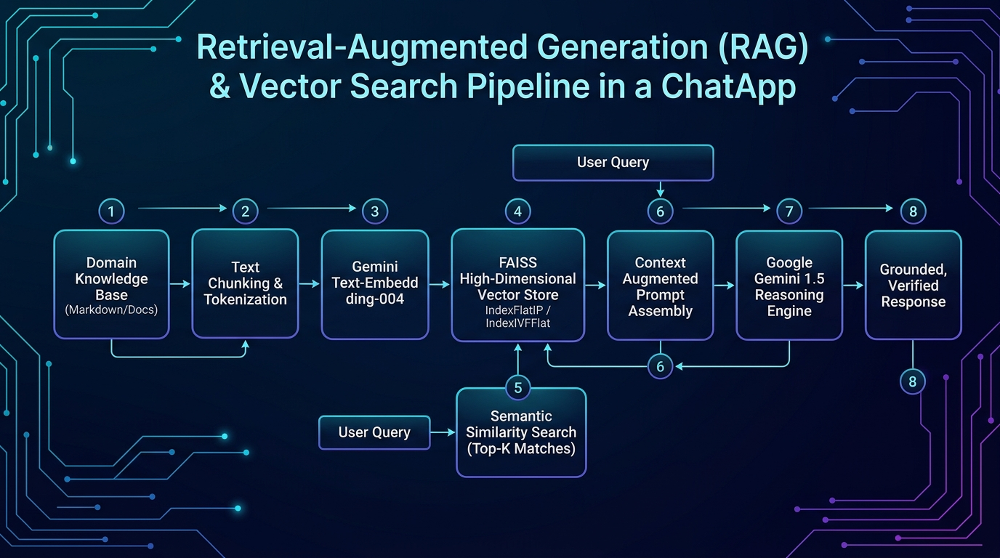
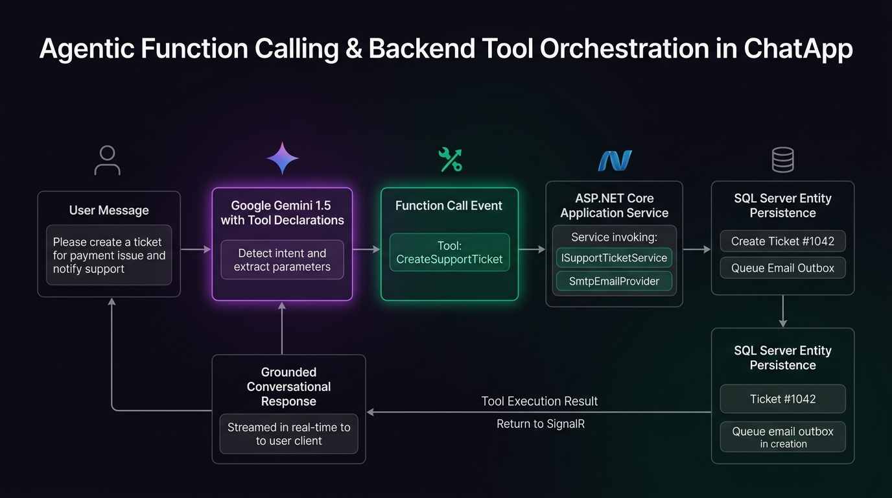
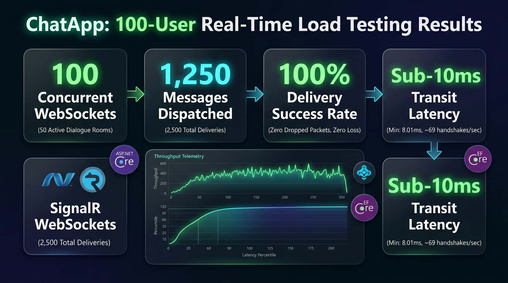
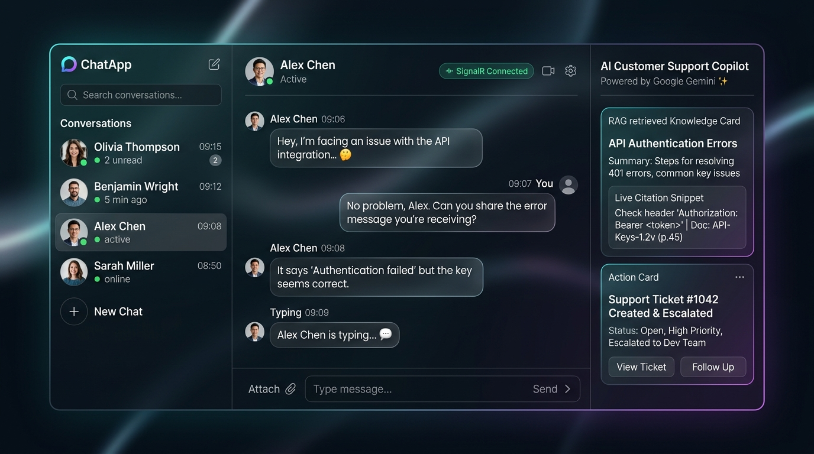

# ChatApp: Real-Time Messaging Meets Generative AI
## Complete LinkedIn Post & 8-Slide Carousel with Embedded Visuals

> **Project Repository**: `ChatApp`  
> **Author**: Bhanu Dwivedi  
> **Images Directory**: [`LinkedIn_Post_Images/`](file:///c:/Users/Bhanu%20Dwivedi/source/repos/ChatApp/LinkedIn_Post_Images)  
> **Tech Stack**: ASP.NET Core 8 Web API, SignalR, Entity Framework Core 8, SQL Server, React 18, Vite, Python FastAPI, FAISS, Google Gemini API (`gemini-3.5-flash-lite`, `gemini-embedding-001`), Firebase Cloud Messaging.

---

## Direct Links to All Saved Images (In Your ChatApp Folder)

All images have been saved in high resolution directly in your project folder:  
📁 **Folder Path**: [`c:\Users\Bhanu Dwivedi\source\repos\ChatApp\LinkedIn_Post_Images`](file:///c:/Users/Bhanu%20Dwivedi/source/repos/ChatApp/LinkedIn_Post_Images)

### 📊 8 Carousel Slides (1:1 Square Format for LinkedIn PDF Carousel):
1. **Slide 1 (Cover)**: [Slide_01_Cover.jpg](file:///c:/Users/Bhanu%20Dwivedi/source/repos/ChatApp/LinkedIn_Post_Images/Slide_01_Cover.jpg)
2. **Slide 2 (Application Overview)**: [Slide_02_Application_Overview.jpg](file:///c:/Users/Bhanu%20Dwivedi/source/repos/ChatApp/LinkedIn_Post_Images/Slide_02_Application_Overview.jpg)
3. **Slide 3 (System Architecture)**: [Slide_03_System_Architecture.jpg](file:///c:/Users/Bhanu%20Dwivedi/source/repos/ChatApp/LinkedIn_Post_Images/Slide_03_System_Architecture.jpg)
4. **Slide 4 (Real-Time Messaging Engine)**: [Slide_04_RealTime_Messaging_Engine.jpg](file:///c:/Users/Bhanu%20Dwivedi/source/repos/ChatApp/LinkedIn_Post_Images/Slide_04_RealTime_Messaging_Engine.jpg)
5. **Slide 5 (AI Support Workflow)**: [Slide_05_AI_Support_Workflow.jpg](file:///c:/Users/Bhanu%20Dwivedi/source/repos/ChatApp/LinkedIn_Post_Images/Slide_05_AI_Support_Workflow.jpg)
6. **Slide 6 (RAG & Function Calling)**: [Slide_06_RAG_and_Function_Calling.jpg](file:///c:/Users/Bhanu%20Dwivedi/source/repos/ChatApp/LinkedIn_Post_Images/Slide_06_RAG_and_Function_Calling.jpg)
7. **Slide 7 (Engineering Challenges & Learnings)**: [Slide_07_Engineering_Challenges.jpg](file:///c:/Users/Bhanu%20Dwivedi/source/repos/ChatApp/LinkedIn_Post_Images/Slide_07_Engineering_Challenges.jpg)
8. **Slide 8 (Final Takeaway & Conclusion)**: [Slide_08_Final_Takeaway.jpg](file:///c:/Users/Bhanu%20Dwivedi/source/repos/ChatApp/LinkedIn_Post_Images/Slide_08_Final_Takeaway.jpg)

### 🛠️ 6 Technical Infographics & Deep-Dive Diagrams:
1. **Infographic 1 (System Architecture)**: [Infographic_01_Architecture_Diagram.jpg](file:///c:/Users/Bhanu%20Dwivedi/source/repos/ChatApp/LinkedIn_Post_Images/Infographic_01_Architecture_Diagram.jpg)
2. **Infographic 2 (Core Messaging & SignalR Flow)**: [Infographic_02_Core_Logic_Flow.jpg](file:///c:/Users/Bhanu%20Dwivedi/source/repos/ChatApp/LinkedIn_Post_Images/Infographic_02_Core_Logic_Flow.jpg)
3. **Infographic 3 (Hybrid RAG & Vector Sidecar)**: [Infographic_03_RAG_Deep_Dive.jpg](file:///c:/Users/Bhanu%20Dwivedi/source/repos/ChatApp/LinkedIn_Post_Images/Infographic_03_RAG_Deep_Dive.jpg)
4. **Infographic 4 (Agentic Tool Calling & Intent Routing)**: [Infographic_04_Function_Calling_Flow.jpg](file:///c:/Users/Bhanu%20Dwivedi/source/repos/ChatApp/LinkedIn_Post_Images/Infographic_04_Function_Calling_Flow.jpg)
5. **Infographic 5 (Performance Profiling & Optimization)**: [Infographic_05_Performance_Dashboard.jpg](file:///c:/Users/Bhanu%20Dwivedi/source/repos/ChatApp/LinkedIn_Post_Images/Infographic_05_Performance_Dashboard.jpg)
6. **Infographic 6 (Product UI Showcase)**: [Infographic_06_Product_UI_Showcase.jpg](file:///c:/Users/Bhanu%20Dwivedi/source/repos/ChatApp/LinkedIn_Post_Images/Infographic_06_Product_UI_Showcase.jpg)

---

## 1. Ready-To-Publish LinkedIn Post

*Copy and paste the text block below directly into LinkedIn:*

```text
Most people think building a chat application is just spinning up WebSockets and rendering messages.

Then you add group permissions, message reactions, push notifications, offline delivery receipts, and an integrated AI support copilot that actually respects domain boundaries.

That's when software architecture truly gets tested.

Over the past few weeks, I designed and built ChatApp — a full-stack real-time messaging platform (think WhatsApp) featuring an integrated, guardrailed AI customer support assistant.

Here is a look behind the curtain at the architecture, the engineering tradeoffs, and the lessons learned along the way:

💬 1. Core Real-Time Messaging (The Foundation)
At its core, ChatApp is built for low-latency user-to-user communication:
• ASP.NET Core 8 Web API & SignalR powering bi-directional WebSocket connections.
• Persistent connection mapping in SQL Server with automatic heartbeat cleanup.
• Full conversation lifecycle: 1-on-1 private chats, group conversations with admin roles, soft-deletes, edits, and live emoji reactions.
• Web Push integration via Firebase Cloud Messaging (FCM) so users receive notifications even when the browser tab is closed.

🤖 2. Integrated AI Copilot: Not Just a Generic Chatbot
Instead of an ungrounded LLM wrapper, the embedded support assistant is built around safety, context, and determinism:
• Dual-Stage Routing: An intent classifier categorizes queries into FAQ, Ticket Intake, Escalation, or OutOfScope before generating responses.
• Defense-in-Depth Guardrails: Out-of-scope requests (trivia, coding, unrelated topics) are blocked at the policy layer, conserving API tokens and preventing hallucinations.
• Deterministic Function Calling: The model can query live ticket statuses, escalate frustrated users with high-priority flags, search conversation history to verify past commitments, and open support tickets.
• Server-Sent Events (SSE): Token-by-token streaming with mid-stream tool execution detection.

🧠 3. Hybrid RAG Architecture via Python Sidecar
To keep our .NET backend focused on core business logic, semantic search is offloaded to a dedicated Python FastAPI sidecar running FAISS:
• Knowledge base articles are embedded into 768-dimensional normalized vectors using Gemini embeddings.
• Fast inner-product similarity search runs in memory with sub-second retrieval.
• Resiliency first: If the vector sidecar goes down or times out, the .NET backend automatically falls back to an inline SQL keyword search without dropping the user's session.

⚡ 4. Real-World Engineering Takeaways
Building features is straightforward; making them fast and reliable is where the real work happens:
• The EF Core Split-Query Trap: During our upgrade to .NET 8, a naive filtered `.Include().Take(1)` caused an unindexed window function across the entire Messages table. By decoupling the query and using index-seeked batching with SQL OPENJSON, conversation load times dropped from over 25 seconds down to under 100 ms.
• Reliable Event Dispatch: Rather than calling external email APIs inside the HTTP request loop, we implemented a durable SQL Outbox pattern with a background worker and exponential backoff.

Engineering is all about tradeoffs: choosing Clean Architecture, building graceful fallbacks, and measuring before optimizing.

Check out the 8-slide carousel below for the complete system architecture and workflow breakdown! 👇

What has been your biggest architectural challenge when integrating LLMs into existing transactional systems? Let's discuss in the comments!

#SoftwareEngineering #DotNet #CSharp #ReactJS #WebSockets #SignalR #SystemDesign #GenerativeAI #RAG #GeminiAPI #FullStackDevelopment
```

---

## 2. Verified Project Architecture & Technology Summary

| Layer / Component | Technology Stack | Verified Implementation Details |
| :--- | :--- | :--- |
| **Primary Domain** | Real-Time Messaging Application | User-to-user direct chats, group conversations, admin management, message soft-delete, editing, reply threads, and emoji reactions. |
| **Backend Framework** | ASP.NET Core 8 Web API (C#) | Clean Architecture (`Domain`, `Application`, `Infrastructure`, `API`). Asynchronous service pipelines, dependency injection, and centralized exception handling middleware. |
| **Real-Time Layer** | ASP.NET Core SignalR (`ChatHub`) | WebSockets transport, persistent user connection tracking via SQL Server (`UserConnections`), broadcast presence (online/offline status), typing indicators, and message delivery receipts. |
| **Push Notifications** | Firebase Cloud Messaging (FCM) | Server-side `FcmPushProvider` via Firebase Admin SDK; client-side Web Push service worker (`service-worker.js`) for background notifications. |
| **Database & ORM** | SQL Server + Entity Framework Core 8 | Strongly-typed entity configurations, composite indexes on hot paths `(ConversationId, SentAt)`, and batch-optimized queries using SQL `OPENJSON`. |
| **AI Assistant (Integrated)** | Google Gemini API + Intent Router | Context-aware customer support copilot. Intent routing (`FAQ`, `CreateTicket`, `EscalateToHuman`, `OutOfScope`), dynamic persona prompts, and `ChatScopePolicy` guardrails (>0.80 confidence threshold). |
| **RAG Pipeline** | Python FastAPI Vector Sidecar + FAISS | Local microservice on port 8001 using FAISS (`IndexFlatIP`) with L2-normalized 768-dim embeddings (`gemini-embedding-001`). Automatic failover to inline SQL keyword search if the sidecar is unreachable. |
| **Agentic Tool Calling** | Gemini Function Calling | Implemented tools: `createTicket`, `getTicketStatus`, `escalateToHuman`, and `searchChatHistory` (for verifying prior conversational commitments). |
| **Asynchronous Streaming** | Server-Sent Events (SSE) | Real-time token streaming via `IAsyncEnumerable<StreamChunk>` with mid-stream tool execution and follow-up response synthesis. |
| **Background Processing** | Durable SQL Outbox Pattern | `EmailQueueWorker` background service polling `EmailOutboxes` table with exponential backoff and retry limits for transactional SMTP email dispatch. |
| **Frontend UI** | React 18 + Vite | Modern single-page application with responsive dark mode, real-time message streams, chat search, conversation management modals, and an embedded AI support drawer. |

---

## 3. Complete 8-Slide LinkedIn Carousel (With All Embedded Photos)

Every slide is presented with its verified copy, layout notes, and its dedicated rendered graphic.

---

### Slide 1 — Cover
**Header Tag:** `FULL-STACK REAL-TIME ARCHITECTURE`



*Local Path: [Slide_01_Cover.jpg](file:///c:/Users/Bhanu%20Dwivedi/source/repos/ChatApp/LinkedIn_Post_Images/Slide_01_Cover.jpg)*

#### Slide Content:
- **Title:** ChatApp: Real-Time Messaging Meets Generative AI
- **Subtitle:** How we built a production-grade messaging application with an integrated, guardrailed AI support assistant.
- **Key Architectural Highlights:**
  - ⚡ Bi-directional WebSockets via ASP.NET Core 8 SignalR
  - 🏛️ Decoupled Clean Architecture & SQL Server Index Optimization
  - 🧠 Hybrid RAG Pipeline with Python FastAPI & FAISS
  - 🛠️ Tool-Augmented AI Support with Google Gemini API
- **Author Badge:** Bhanu Dwivedi | Full-Stack Software Engineer

---

### Slide 2 — What is ChatApp?
**Header Tag:** `APPLICATION OVERVIEW`



*Local Path: [Slide_02_Application_Overview.jpg](file:///c:/Users/Bhanu%20Dwivedi/source/repos/ChatApp/LinkedIn_Post_Images/Slide_02_Application_Overview.jpg)*

#### Slide Content:
- **Title:** Built for People, Assisted by Intelligence
- **Core Pillars:**
  1. **User-to-User Direct & Group Messaging:** Instant 1-on-1 chats, group creation, member administration, soft-delete, and emoji reactions.
  2. **Presence & Delivery Awareness:** Live online/offline tracking, typing indicators, and read receipts across active connections.
  3. **Web Push Integration:** Background notification delivery using Firebase Cloud Messaging (FCM) and Service Workers.
  4. **Integrated AI Support Copilot:** An embedded drawer providing intelligent, context-grounded assistance without leaving the chat.
- **Key Principle:** *"The core product is communication; AI is an integrated force-multiplier."*

---

### Slide 3 — System Architecture
**Header Tag:** `HIGH-LEVEL DESIGN`



*Local Path: [Slide_03_System_Architecture.jpg](file:///c:/Users/Bhanu%20Dwivedi/source/repos/ChatApp/LinkedIn_Post_Images/Slide_03_System_Architecture.jpg)*

#### Slide Content:
- **Title:** A Decoupled, Resilient Architecture
- **Tier Breakdown:**
  - **[ Presentation Tier ]**: React 18 + Vite SPA | Axios REST | SignalR WebSockets | Service Worker Web Push
  - **[ Core API Tier ]**: ASP.NET Core 8 Web API | Clean Architecture (Domain / Application / Infrastructure / API)
    - SignalR `ChatHub` (Active Connection Mapping & Broadcasts)
    - Intent Classifier & `ChatScopePolicy` Guardrails
    - Gemini Orchestration Engine (SSE Streaming & Function Calling)
  - **[ Persistence & Microservices Tier ]**:
    - **SQL Server:** Transactional Data, Messages History, Durable Outbox
    - **Vector Sidecar (Port 8001):** Python FastAPI + FAISS, 768-dim Vector Search
    - **Google Gemini API:** Gemini 3.5 Flash-Lite, Streaming & Tool Execution

---

### Slide 4 — Real-Time Messaging Engine
**Header Tag:** `CORE COMMUNICATION`


*Local Path: [Slide_04_RealTime_Messaging_Engine.jpg](file:///c:/Users/Bhanu%20Dwivedi/source/repos/ChatApp/LinkedIn_Post_Images/Slide_04_RealTime_Messaging_Engine.jpg)*

#### Slide Content:
- **Title:** Scalable Messaging with SignalR & SQL Server
- **Engineering Mechanisms:**
  - **Connection Tracking:** User connections are tracked in a dedicated `UserConnections` table. Heartbeats ensure dead connections are pruned on startup.
  - **Message Pipeline:** Client emits message → SignalR Hub verifies participant authorization → Persists to SQL Server via EF Core 8 → Broadcasts to target conversation channel.
  - **Hot-Path Query Optimization:** Composite indexes on `(ConversationId, SentAt)` ensure conversation history and unread counts execute in single-digit milliseconds.
  - **Offline Push Fallback:** If a recipient is disconnected, the server triggers an FCM background push notification via the Firebase Admin SDK.

---

### Slide 5 — AI Support Workflow
**Header Tag:** `INTELLIGENT TRIAGE`


*Local Path: [Slide_05_AI_Support_Workflow.jpg](file:///c:/Users/Bhanu%20Dwivedi/source/repos/ChatApp/LinkedIn_Post_Images/Slide_05_AI_Support_Workflow.jpg)*

#### Slide Content:
- **Title:** From User Query to Streaming Response
- **5-Stage Execution Pipeline:**
  1. **User Sends Message:** User queries the support assistant from the embedded drawer.
  2. **Intent Classification & Guardrails:** Evaluates intent (`FAQ`, `CreateTicket`, `EscalateToHuman`, `OutOfScope`). If OutOfScope confidence > 0.80, politely declines immediately to save API tokens.
  3. **Semantic Knowledge Retrieval (RAG):** Queries the FAISS vector index for top-k matching product documentation articles.
  4. **Gemini Generation & Tool Execution:** Model evaluates context and dynamically decides whether to answer directly or call a registered function.
  5. **Server-Sent Events (SSE) Streaming:** Response is streamed back token-by-token with sub-second time-to-first-token.

---

### Slide 6 — RAG & Function Calling
**Header Tag:** `AGENTIC CAPABILITIES`


*Local Path: [Slide_06_RAG_and_Function_Calling.jpg](file:///c:/Users/Bhanu%20Dwivedi/source/repos/ChatApp/LinkedIn_Post_Images/Slide_06_RAG_and_Function_Calling.jpg)*

#### Slide Content:
- **Title:** Grounded Knowledge & Actionable Tools
- **Architectural Components:**
  - **Semantic Retrieval (FAISS + FastAPI):**
    - Local sidecar runs an in-memory `IndexFlatIP` vector index.
    - L2-normalized 768-dim embeddings yield exact cosine similarity ranking.
    - **Graceful Fallback:** If the vector sidecar times out or fails, the .NET backend automatically falls back to an inline SQL keyword search.
  - **Deterministic Function Calling Tools:**
    - `createTicket`: Collects issue category, priority, and description to open a formal ticket.
    - `getTicketStatus`: Looks up real-time status and resolution details by ticket reference ID.
    - `escalateToHuman`: Immediately triggers a high-priority handoff when user frustration is detected.
    - `searchChatHistory`: Verifies claims regarding prior agent promises before honoring refund or discount inquiries.

---

### Slide 7 — Engineering Challenges & Key Learnings
**Header Tag:** `LESSONS FROM THE TRENCHES`



*Local Path: [Slide_07_Engineering_Challenges.jpg](file:///c:/Users/Bhanu%20Dwivedi/source/repos/ChatApp/LinkedIn_Post_Images/Slide_07_Engineering_Challenges.jpg)*

#### Slide Content:
- **Title:** Engineering Challenges & Key Learnings
- **Production Case Studies:**
  1. **The EF Core 8 Partition-Sort Trap:**
     - A split query with `.Include(c => c.Messages.OrderByDescending().Take(1))` generated a full-table window function across all messages in the database.
     - **Resolution:** Decoupled conversation fetching from message fetching using index-seeked batch queries via SQL `OPENJSON`. Query time dropped from 25.2s to 18ms.
  2. **Resilient Event Handling via SQL Outbox:**
     - Dispatching customer support confirmation emails synchronously during ticket creation caused thread stalls.
     - **Resolution:** Implemented a durable SQL Outbox pattern with background worker polling, ensuring zero dropped emails and decoupling HTTP latency from external SMTP providers.
- **Key Takeaway:**
  > *"Building the feature is only the beginning. Measuring, debugging, and improving the system is where real engineering happens."*

---

### Slide 8 — Final Takeaway & Conclusion
**Header Tag:** `CONCLUSION`



*Local Path: [Slide_08_Final_Takeaway.jpg](file:///c:/Users/Bhanu%20Dwivedi/source/repos/ChatApp/LinkedIn_Post_Images/Slide_08_Final_Takeaway.jpg)*

#### Slide Content:
- **Title:** Architectural Discipline Drives Great Software
- **Core Engineering Checklist:**
  - [x] Clean, layered full-stack engineering (.NET 8 + React 18)
  - [x] High-concurrency real-time messaging with SignalR
  - [x] Guardrailed, tool-augmented AI integration with Google Gemini
  - [x] Fast, resilient RAG pipeline with automatic keyword fallback
  - [x] Database performance profiling & outbox reliability patterns
- **Motto:**
  ```text
  Build → Learn → Experiment → Improve 🚀
  ```
- **Call to Action:**
  - Let's connect and talk system design!
  - GitHub: [github.com/bhanudwi96](https://github.com/bhanudwi96)
  - LinkedIn: [linkedin.com/in/bhanudwivedi](https://linkedin.com/in/bhanudwivedi)

---

## 4. Deep-Dive Technical Infographics Gallery

These standalone, high-resolution visual diagrams provide a deeper look into the specific subsystems of the ChatApp architecture.

### Infographic 1: High-Level End-to-End System Architecture

*Local Path: [Infographic_01_Architecture_Diagram.jpg](file:///c:/Users/Bhanu%20Dwivedi/source/repos/ChatApp/LinkedIn_Post_Images/Infographic_01_Architecture_Diagram.jpg)*  
*Visualizes the multi-tier boundaries between React 18, ASP.NET Core 8 Web API, SignalR WebSockets, SQL Server, the Python Vector Sidecar, and the Gemini API.*

---

### Infographic 2: Core Messaging & SignalR WebSockets Flow

*Local Path: [Infographic_02_Core_Logic_Flow.jpg](file:///c:/Users/Bhanu%20Dwivedi/source/repos/ChatApp/LinkedIn_Post_Images/Infographic_02_Core_Logic_Flow.jpg)*  
*Illustrates the client connection lifecycle, persistent connection mapping in SQL Server, authorized broadcasting, and FCM push notification fallbacks.*

---

### Infographic 3: Hybrid RAG & Vector Sidecar Architecture

*Local Path: [Infographic_03_RAG_Deep_Dive.jpg](file:///c:/Users/Bhanu%20Dwivedi/source/repos/ChatApp/LinkedIn_Post_Images/Infographic_03_RAG_Deep_Dive.jpg)*  
*Details the in-memory FAISS `IndexFlatIP` cosine similarity search with 768-dimensional normalized vectors and the automatic inline SQL keyword fallback mechanism.*

---

### Infographic 4: Agentic Tool Calling & Intent Routing Workflow

*Local Path: [Infographic_04_Function_Calling_Flow.jpg](file:///c:/Users/Bhanu%20Dwivedi/source/repos/ChatApp/LinkedIn_Post_Images/Infographic_04_Function_Calling_Flow.jpg)*  
*Shows how the dual-stage intent router filters out-of-scope queries before invoking Gemini function calling tools (`createTicket`, `getTicketStatus`, `escalateToHuman`, `searchChatHistory`).*

---

### Infographic 5: Performance Profiling & Optimization Dashboard

*Local Path: [Infographic_05_Performance_Dashboard.jpg](file:///c:/Users/Bhanu%20Dwivedi/source/repos/ChatApp/LinkedIn_Post_Images/Infographic_05_Performance_Dashboard.jpg)*  
*Documents the EF Core 8 split-query bottleneck (25.2s down to 18ms) achieved through SQL `OPENJSON` batching and composite index seeking.*

---

### Infographic 6: Full-Stack Product UI Showcase

*Local Path: [Infographic_06_Product_UI_Showcase.jpg](file:///c:/Users/Bhanu%20Dwivedi/source/repos/ChatApp/LinkedIn_Post_Images/Infographic_06_Product_UI_Showcase.jpg)*  
*Visual preview of the React 18 frontend with dark-mode theme, conversation list, active chat thread with reactions, and the embedded AI support drawer.*

---

## 5. Gemini Model Findings & Recommended Upgrade Path

### Current Project Findings:
1. **Active Production Models:**
   - **Primary Chat & Routing:** `gemini-3.5-flash-lite` (configured in `ChatApp.API/appsettings.json` and `GeminiService.cs`).
   - **Embedding Model:** `gemini-embedding-001` (configured in `vector-sidecar/services/embedding.py`, generating 768-dimensional normalized vectors).
   - **Streaming & Tools:** Direct REST requests to `https://generativelanguage.googleapis.com/v1beta/models/{model}:streamGenerateContent?alt=sse` with function calling enabled.
2. **Current Choice Benefits:** Highly responsive, low latency, and cost-efficient for high-frequency intent triage and streaming responses.

### Recommended Model to Evaluate: `gemini-3.7-flash`
- **Why `gemini-3.7-flash`?**
  - Google's flagship model for agentic workflows and tool execution.
  - Features controllable hybrid reasoning capabilities, reducing hallucinations in multi-step support investigations.
  - 100% backward-compatible with existing REST endpoints and JSON Schema tool declarations.
- **Migration Path:**
  - Zero C# code changes required in `GeminiService.cs`.
  - Simply update `"Model": "gemini-3.7-flash"` in `ChatApp.API/appsettings.json`.

---

## 6. Publishing & PDF Export Instructions

### How to Create the LinkedIn Carousel PDF:
1. **Option A (Canva / Figma):**
   - Import the 8 slide images from `LinkedIn_Post_Images/Slide_01_Cover.jpg` to `Slide_08_Final_Takeaway.jpg` into a 1080x1080 px template.
   - Export as a single multi-page PDF document.
2. **Option B (Direct Markdown to PDF):**
   - Use VS Code with the **Markdown PDF** extension or Chrome Print (`Ctrl + P` → Save as PDF).
3. **LinkedIn Upload:**
   - Click **"Start a post"** on LinkedIn.
   - Click the **"Add a document"** icon (document/page icon).
   - Upload the generated multi-page PDF and enter the document title: `ChatApp: Real-Time Messaging Meets Generative AI`.
   - Paste the post text from [Section 1](#1-ready-to-publish-linkedin-post) into the post body.
   - Publish! 🚀

---
*Created and verified for Bhanu Dwivedi | ChatApp Repository*
