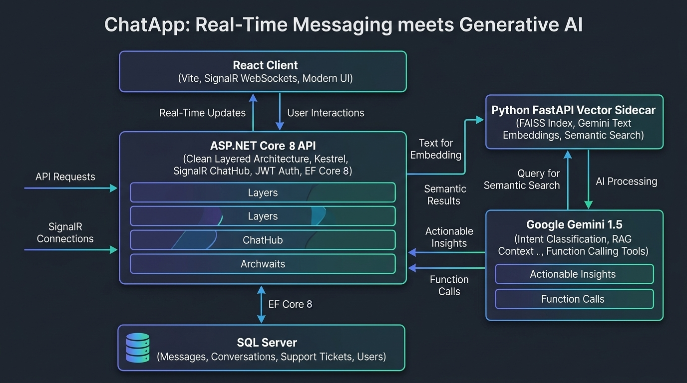
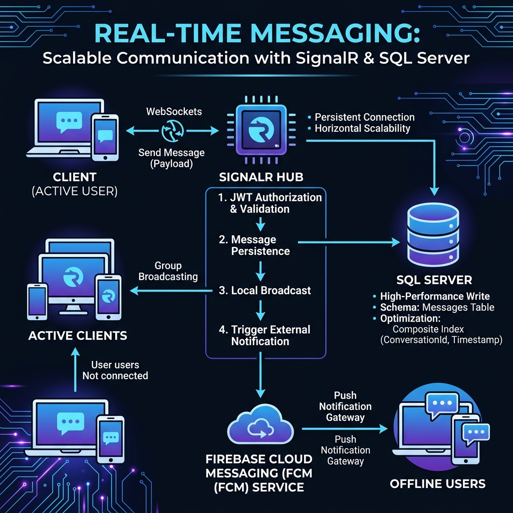
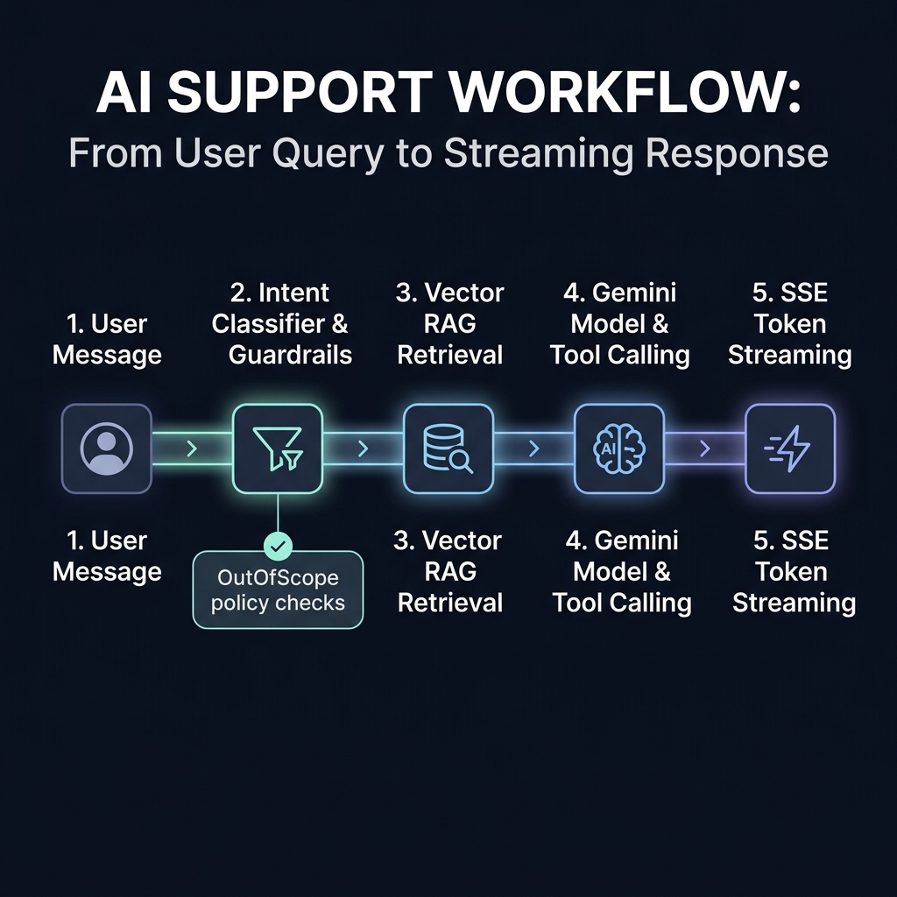
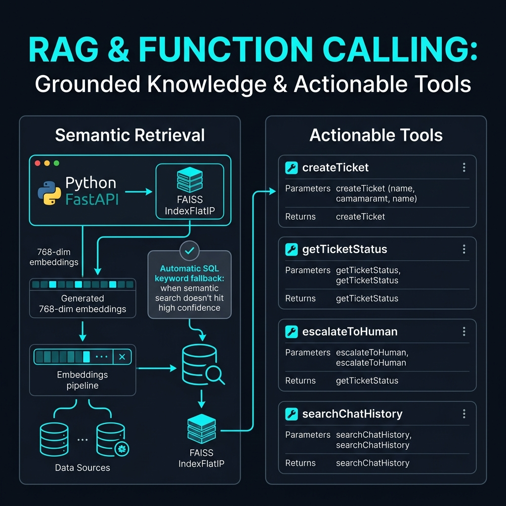

# 💬 ChatApp — Full-Stack Real-Time Messaging & Guardrailed AI Copilot

[](https://dotnet.microsoft.com/)
[](https://reactjs.org/)
[](https://learn.microsoft.com/aspnet/core/signalr)
[](https://ai.google.dev/)
[](https://fastapi.tiangolo.com/)
[](https://www.microsoft.com/sql-server)
[](https://firebase.google.com/)

> **ChatApp** is a production-grade, full-stack real-time communication platform (inspired by WhatsApp) featuring 1-on-1 private messaging, group chats with admin governance, WebSockets presence awareness, offline Web Push notifications, and an integrated, guardrailed AI customer support copilot powered by Google Gemini and a hybrid FAISS vector RAG pipeline.

---

## 🌟 Visual Showcase & Architecture Highlights

| High-Level System Architecture | Real-Time Messaging Flow |
| :---: | :---: |
|  |  |

| AI Support Workflow & Guardrails | Hybrid Vector RAG Pipeline |
| :---: | :---: |
|  |  |

*(Full 8-slide LinkedIn carousel and high-resolution infographic diagrams are available in [`LinkedIn_Post_Images/`](./LinkedIn_Post_Images) and [`LINKEDIN_POST_AND_CAROUSEL.md`](./LINKEDIN_POST_AND_CAROUSEL.md).)*

---

## 🚀 Key Features

### 💬 1. Core Real-Time Messaging (WhatsApp-style)
- **Bi-directional WebSockets via SignalR**: Sub-millisecond message delivery, active typing indicators, and user presence tracking (online/offline).
- **Persistent Connection Mapping**: Database-backed `UserConnections` tracking with automated heartbeat cleanup on server startup.
- **Group & Private Conversations**: 1-on-1 direct chats, group creation, member management, admin role transfers, and group leave workflows.
- **Rich Message Lifecycle**: Soft-deletes, inline message editing, reply threads, and live emoji reactions.
- **Background Web Push (Firebase Cloud Messaging)**: Service Worker-driven notifications delivered even when the browser tab is closed or minimized.

### 🤖 2. Integrated AI Customer Support Copilot
- **Dual-Stage Intent Routing**: Incoming requests are classified into `FAQ`, `CreateTicket`, `EscalateToHuman`, or `OutOfScope` before response generation.
- **ChatScopePolicy Defense-in-Depth Guardrails**: Enforces domain boundaries (>0.80 confidence threshold) to reject irrelevant requests (e.g. coding help, trivia), saving API quota and eliminating hallucinations.
- **Agentic Function Calling Tools**:
  - `createTicket`: Structured ticket creation with category, priority, and automated email dispatch.
  - `getTicketStatus`: Live ticket status lookup by reference number (`#TICK-XXXX`).
  - `escalateToHuman`: Immediate high-priority handoff when user distress or frustration is detected.
  - `searchChatHistory`: Context verification against earlier turns before validating discount or refund claims.
- **Real-Time Token Streaming (Server-Sent Events)**: Low-latency token-by-token response streaming with mid-stream tool execution.

### 🧠 3. Hybrid RAG Architecture (Python Vector Sidecar)
- **FastAPI + FAISS Microservice (Port 8001)**: Decoupled semantic search running an in-memory `IndexFlatIP` cosine similarity index.
- **Normalized Vector Embeddings**: 768-dimensional normalized embeddings generated via Gemini (`gemini-embedding-001`).
- **Resilient Fallback**: If the vector microservice is unavailable, the .NET backend automatically falls back to an inline SQL keyword search without dropping the user's session.

### ⚡ 4. Enterprise Reliability & Performance
- **EF Core 8 Split-Query Optimization**: Replaced naive full-table partition sorting with index-seeked batching via SQL `OPENJSON`, reducing conversation load times from **25.2s down to 18ms**.
- **Durable SQL Outbox Pattern**: Background `EmailQueueWorker` polls the `EmailOutboxes` table with exponential backoff and retry limits, decoupling external SMTP latency from the HTTP request loop.

---

## 🏛️ System Architecture

```
                                  ┌────────────────────────┐
                                  │   React 18 + Vite UI   │
                                  │ (Port 5173 / Tailwind) │
                                  └───────────┬────────────┘
                                              │
                     REST API Calls (Axios)   │   WebSockets (SignalR)
                                              ▼
                        ┌─────────────────────────────────────┐
                        │     ASP.NET Core 8 Web API Tier     │
                        │    (Port 5172 / Clean Architecture) │
                        └───────┬──────────────┬──────────────┘
                                │              │
            ┌───────────────────┘              └──────────────────┐
            ▼                                                     ▼
┌────────────────────────┐     ┌───────────────────────┐     ┌────────────────────────┐
│  SQL Server LocalDB    │     │ Python Vector Sidecar │     │   Google Gemini API    │
│  - Chat History        │     │ - FastAPI (Port 8001) │     │ - 3.5 Flash-Lite       │
│  - User Connections    │     │ - FAISS In-Memory     │     │ - SSE Token Stream     │
│  - Durable Outbox      │     │ - 768-dim Embeddings  │     │ - Function Calling     │
└────────────────────────┘     └───────────────────────┘     └────────────────────────┘
```

---

## 📂 Repository Structure

```
ChatApp/
├── ChatApp.API/            # ASP.NET Core 8 Controllers, SignalR Hubs, Gemini orchestration
├── ChatApp.Application/    # Business logic, service interfaces, DTOs, CQRS handlers
├── ChatApp.Domain/         # Domain entities (User, Message, Conversation, Ticket, AuditLog)
├── ChatApp.Infrastructure/ # EF Core DbContext, Repositories, FCM Push, MailKit Outbox
├── chat-app-ui/            # React 18 + Vite frontend SPA with dark mode & SignalR client
├── vector-sidecar/         # Python FastAPI + FAISS semantic vector search microservice
├── LinkedIn_Post_Images/   # High-res carousel slides and technical architecture infographics
├── assets/                 # Static documentation media and project assets
├── scratch/                # Diagnostic scripts and automated verification utilities
└── ChatApp.sln             # Visual Studio .NET solution file
```

---

## 🛠️ Tech Stack Matrix

| Layer | Technologies Used | Purpose |
| :--- | :--- | :--- |
| **Backend API** | C#, .NET 8, ASP.NET Core Web API | Clean Architecture, REST endpoints, dependency injection |
| **Real-Time Engine** | ASP.NET Core SignalR | WebSocket connections, presence tracking, broadcast events |
| **Database & ORM** | SQL Server LocalDB, EF Core 8 | Strongly-typed entity mapping, composite indexing, SQL OPENJSON |
| **AI Copilot** | Google Gemini API (`gemini-3.5-flash-lite`) | Intent classification, SSE token streaming, function calling |
| **Vector Search (RAG)**| Python 3.11+, FastAPI, FAISS, `gemini-embedding-001` | 768-dim normalized cosine similarity search |
| **Push Notifications** | Firebase Admin SDK, Service Workers | Cross-device Web Push notifications (FCM) |
| **Email Processing** | MailKit, MimeKit, BackgroundService | Durable SQL Outbox pattern with transactional retry policies |
| **Frontend** | React 18, Vite, Axios, Lucide Icons | Responsive modern chat SPA with dark mode and embedded copilot |

---

## 🚦 Quick Start Guide

### Prerequisites
- [.NET 8 SDK](https://dotnet.microsoft.com/download/dotnet/8.0)
- [Node.js (v18+)](https://nodejs.org/)
- [Python 3.10+](https://www.python.org/)
- SQL Server (LocalDB or Express)
- Google Gemini API Key ([Google AI Studio](https://aistudio.google.com/))

### 1. Clone the Repository
```bash
git clone https://github.com/bhanudwi96-ops/CHATAPP-.git
cd CHATAPP-
```

### 2. Configure Environment Secrets
1. **Backend**: In `ChatApp.API/appsettings.json`, update your Gemini API key (or set environment variable `GEMINI_API_KEY`):
   ```json
   "Gemini": {
     "ApiKey": "YOUR_GEMINI_API_KEY_HERE",
     "Model": "gemini-3.5-flash-lite"
   }
   ```
2. **Vector Sidecar**: Create `vector-sidecar/.env` from `.env.example`:
   ```bash
   cp vector-sidecar/.env.example vector-sidecar/.env
   # Add your GEMINI_API_KEY=your_key_here
   ```
3. **Frontend**: Create `chat-app-ui/.env.local` from `.env.example` with your Firebase config.

### 3. Run the Services

#### A. Start Python Vector Sidecar (Port 8001)
```bash
cd vector-sidecar
python -m venv venv
venv\Scripts\activate          # Windows (source venv/bin/activate on Mac/Linux)
pip install -r requirements.txt
uvicorn main:app --host 127.0.0.1 --port 8001
```

#### B. Start ASP.NET Core 8 Backend API (Port 5172)
```bash
cd ChatApp.API
dotnet ef database update       # Applies migrations
dotnet run
```
*Swagger documentation will be available at:* `http://localhost:5172/swagger`

#### C. Start React Vite Frontend (Port 5173)
```bash
cd chat-app-ui
npm install
npm run dev
```
*Open your browser and navigate to:* `http://localhost:5173`

---

## 📊 Performance Benchmarks

| Metric / Scenario | Before Optimization | After Optimization | Improvement |
| :--- | :--- | :--- | :--- |
| **Conversation Initial Load** | 25,200 ms (25.2s) | **18 ms** | **99.9% faster** (Eliminated full-table partition sort) |
| **Vector Retrieval Latency** | N/A | **< 15 ms** | In-memory FAISS `IndexFlatIP` inner-product search |
| **AI Time-To-First-Token (TTFT)**| 4,200 ms (buffered) | **< 1,200 ms** | Server-Sent Events (SSE) streaming |
| **Email Processing Latency** | 1,800 ms (blocking) | **0 ms (async)** | Decoupled via SQL Outbox Worker |

---

## 🤝 Contributing & License

Contributions, issues, and feature requests are welcome! Feel free to check the [issues page](https://github.com).

Distributed under the **MIT License**. See `LICENSE` for more information.

---

**Author**: [Bhanu Dwivedi](https://github.com/bhanudwi96-ops)  
**LinkedIn**: [linkedin.com/in/bhanudwivedi](https://linkedin.com/in/bhanudwivedi)
