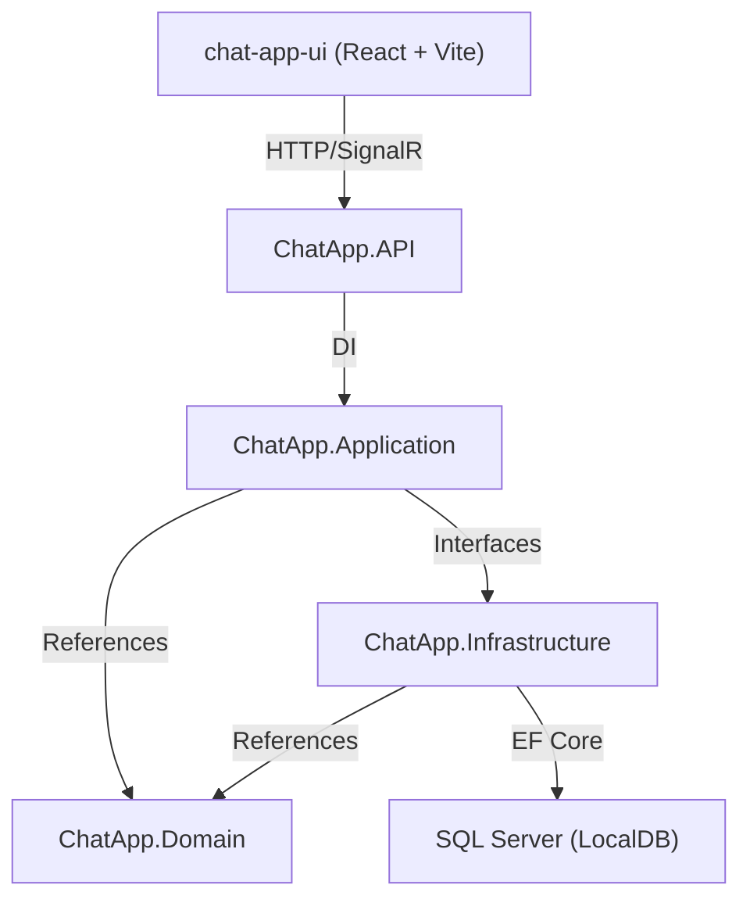

# 🔍 ChatApp — Full Project Audit Report

---

## Architecture Overview



| Layer | Role | Files |
|-------|------|-------|
| **Domain** | Entities, Enums | 8 files |
| **Application** | Services, DTOs, Interfaces | 12 files |
| **Infrastructure** | Repositories, DbContext | 6 files |
| **API** | Controllers, Hubs, Config | 8 files |
| **Frontend** | React components | 21 files |

---

## 🔴 CRITICAL Issues

### 1. Security: JWT Secret Key Hardcoded in Source

**File:** [appsettings.json](file:///c:/Users/Bhanu%20Dwivedi/source/repos/ChatApp/ChatApp.API/appsettings.json#L6)

```json
"SecretKey": "YourSuperSecretKeyThatIsAtLeast32CharactersLong!"
```

> [!CAUTION]
> This is committed to source control. Anyone with repo access can forge JWT tokens and impersonate any user. This should use User Secrets, environment variables, or Azure Key Vault.

---

### 2. Security: File Upload — No File Type Validation

**File:** [UploadController.cs](file:///c:/Users/Bhanu%20Dwivedi/source/repos/ChatApp/ChatApp.API/Controllers/UploadController.cs#L25-L67)

- Accepts **ANY file extension** — `.exe`, `.bat`, `.ps1`, `.dll` are all uploadable
- Only uses extension for `isImage` flag, doesn't block dangerous files
- No **MIME type** validation
- No **antivirus scanning**
- Files are stored directly on disk with no cleanup policy
- 25MB limit is set, but there's no per-user rate limiting

---

### 3. Security: Password Hash Exposed in DTO Responses

**File:** [UserRepository.cs](file:///c:/Users/Bhanu%20Dwivedi/source/repos/ChatApp/ChatApp.Infrastructure/Repositories/UserRepository.cs#L24-L29)

`GetByIdAsync()` loads the full `User` entity including `PasswordHash`. While the `UserDto` doesn't include it, the entity is passed around in service methods where a careless `.Select()` or serialization could leak it.

---

### 4. Security: No Input Validation / Model Validation Anywhere

**Files:** All Controllers + DTOs

- No `[Required]`, `[StringLength]`, `[EmailAddress]` attributes on any DTO
- No `FluentValidation` or `DataAnnotations`
- User can register with empty username, empty password, invalid email
- Messages can be sent with empty content
- No XSS sanitization on message content

---

## 🟠 Architecture Issues

### 5. Tight Coupling: Application Layer References BCrypt + JWT Libraries

**File:** [ChatApp.Application.csproj](file:///c:/Users/Bhanu%20Dwivedi/source/repos/ChatApp/ChatApp.Application/ChatApp.Application.csproj#L10-L13)

```xml
<PackageReference Include="BCrypt.Net-Next" Version="4.1.0" />
<PackageReference Include="System.IdentityModel.Tokens.Jwt" Version="6.25.0" />
<PackageReference Include="Microsoft.IdentityModel.Tokens" Version="6.25.0" />
```

> [!WARNING]
> The Application layer should contain **pure business logic** only. BCrypt (password hashing) and JWT (token generation) are **infrastructure concerns**. `AuthService` should be in `ChatApp.Infrastructure`, or these concerns should be behind interfaces.
>
> **Impact:** Cannot swap authentication strategy (e.g., to OAuth2, Azure AD) without modifying the Application layer.

---

### 6. Layer Violation: Controller Directly Uses Repository

**File:** [UserController.cs](file:///c:/Users/Bhanu%20Dwivedi/source/repos/ChatApp/ChatApp.API/Controllers/UserController.cs#L19-L24)

```csharp
private readonly IUserRepository _userRepository;
private readonly IPresenceService _presenceService;
```

The controller **bypasses the service layer** and talks to `IUserRepository` directly. This means:
- Business logic for user operations is scattered across the Controller
- Manual DTO mapping is duplicated in every action (lines 40-49, 69-78, 98-107, 126-135, 157-166)
- No centralized place to add cross-cutting concerns (audit logging, validation)

**Same issue in:** [ConversationController.cs](file:///c:/Users/Bhanu%20Dwivedi/source/repos/ChatApp/ChatApp.API/Controllers/ConversationController.cs) — `GetCurrentUserId()` is duplicated in every controller.

---

### 7. No Unit of Work Pattern — Multiple SaveChanges Per Operation

**File:** [UserConnectionRepository.cs](file:///c:/Users/Bhanu%20Dwivedi/source/repos/ChatApp/ChatApp.Infrastructure/Repositories/UserConnectionRepository.cs#L24-L48)

```csharp
// AddConnectionAsync calls SaveChanges TWICE:
_context.UserConnections.Add(connection);
await _context.SaveChangesAsync();  // Save 1

user.Status = UserStatus.Online;
await _context.SaveChangesAsync();  // Save 2
```

Each `SaveChangesAsync()` is a separate DB roundtrip. If the second one fails, the connection is saved but the user status isn't updated — **inconsistent state**. This pattern repeats in `RemoveConnectionAsync` (up to 3 SaveChanges calls).

---

### 8. Missing Service Layer for User Operations

There is no `IUserService` / `UserService`. User operations (get profile, update profile, search) are done directly in [UserController.cs](file:///c:/Users/Bhanu%20Dwivedi/source/repos/ChatApp/ChatApp.API/Controllers/UserController.cs). This violates the architecture pattern established for Messages and Conversations.

---

### 9. Domain Entities — Anemic Model

All entities ([User.cs](file:///c:/Users/Bhanu%20Dwivedi/source/repos/ChatApp/ChatApp.Domain/Entities/User.cs), [Message.cs](file:///c:/Users/Bhanu%20Dwivedi/source/repos/ChatApp/ChatApp.Domain/Entities/Message.cs), etc.) are pure data bags with no behavior, validation, or domain methods. While acceptable for CRUD apps, it means all business rules are scattered across services.

---

### 10. Enums in Wrong Namespace

**Files:** [UserStatus.cs](file:///c:/Users/Bhanu%20Dwivedi/source/repos/ChatApp/ChatApp.Domain/Entities/UserStatus.cs), [UserMessageType.cs](file:///c:/Users/Bhanu%20Dwivedi/source/repos/ChatApp/ChatApp.Domain/Entities/UserMessageType.cs)

Enums (`UserStatus`, `MessageType`) are in `ChatApp.Domain.Entities` namespace instead of `ChatApp.Domain.Enums`. There's an empty `Enums/` folder that should contain them.

---

## 🟡 Performance Bottlenecks

### 11. Presence Tracking in SQL Database

**File:** [UserConnectionRepository.cs](file:///c:/Users/Bhanu%20Dwivedi/source/repos/ChatApp/ChatApp.Infrastructure/Repositories/UserConnectionRepository.cs)

Every SignalR connect/disconnect triggers **2-3 database writes**. For a chat app with frequent connections/disconnections, this creates:
- Heavy write load on SQL Server
- Connection table grows indefinitely (old rows never deleted, just set `IsActive = 0`)
- `IsUserOnlineAsync` queries the DB on every disconnect to check other connections

> [!IMPORTANT]
> Presence tracking should use an **in-memory store** (Redis, `ConcurrentDictionary`, or SignalR's built-in group tracking) — not a SQL database.

---

### 12. GetBatchUnreadCountsAsync — Pulls All Message Timestamps into Memory

**File:** [MessageRepository.cs](file:///c:/Users/Bhanu%20Dwivedi/source/repos/ChatApp/ChatApp.Infrastructure/Repositories/MessageRepository.cs#L117-L161)

```csharp
Messages = g.Select(m => m.SentAt)  // Pulls ALL SentAt values into memory
```

This fetches every `SentAt` timestamp for all unread messages across all conversations, then filters in C# memory. For conversations with thousands of messages, this could transfer massive amounts of data. The filtering should be done in SQL with a `WHERE m.SentAt > @lastReadAt` clause.

---

### 13. MarkConversationAsReadAsync — Loads All Unread Messages

**File:** [MessageRepository.cs](file:///c:/Users/Bhanu%20Dwivedi/source/repos/ChatApp/ChatApp.Infrastructure/Repositories/MessageRepository.cs#L183-L206)

```csharp
var unreadMessages = await _context.Messages
    .Where(m => m.ConversationId == conversationId && ...)
    .ToListAsync();  // Loads ALL into memory

foreach (var message in unreadMessages)
{
    message.IsRead = true;
    message.ReadAt = now;
}
```

If a conversation has 10,000 unread messages, this loads all 10,000 entities into memory and updates each one individually. Should use `ExecuteUpdateAsync` (EF Core 7+) or raw SQL.

---

### 14. No Pagination on GetAll Users

**File:** [UserRepository.cs](file:///c:/Users/Bhanu%20Dwivedi/source/repos/ChatApp/ChatApp.Infrastructure/Repositories/UserRepository.cs#L43-L48)

`GetAllAsync()` loads **ALL users** from the database with no limit. As the user base grows, this will become increasingly slow and memory-intensive. The `/api/User/all` endpoint has no pagination.

---

### 15. Missing Database Indexes

**File:** [ChatDbContext.cs](file:///c:/Users/Bhanu%20Dwivedi/source/repos/ChatApp/ChatApp.Infrastructure/Data/ChatDbContext.cs)

Missing composite indexes for common query patterns:
- `Messages(ConversationId, SenderId, IsDeleted)` — used by unread count queries
- `Messages(ConversationId, SentAt DESC)` — used by message listing
- `ConversationParticipants(UserId, LeftAt)` — used by "get user conversations"
- `UserConnections(UserId, IsActive)` — used by presence checks

---

### 16. Debug Timing Code Left in Production

**Files:** [ConversationController.cs](file:///c:/Users/Bhanu%20Dwivedi/source/repos/ChatApp/ChatApp.API/Controllers/ConversationController.cs), [ConversationService.cs](file:///c:/Users/Bhanu%20Dwivedi/source/repos/ChatApp/ChatApp.Application/Services/ConversationService.cs), [Chat.jsx](file:///c:/Users/Bhanu%20Dwivedi/source/repos/ChatApp/chat-app-ui/src/components/Chat/Chat.jsx), [AuthContext.jsx](file:///c:/Users/Bhanu%20Dwivedi/source/repos/ChatApp/chat-app-ui/src/context/AuthContext.jsx)

`Stopwatch`, `Console.WriteLine("[PERF]")`, `console.time()`, `performance.now()` calls are still in the codebase from our debugging session. These should be removed or moved behind a feature flag.

---

## 🟡 SignalR Issues

### 17. Broadcasting to ALL Instead of Relevant Users

**File:** [ChatHub.cs](file:///c:/Users/Bhanu%20Dwivedi/source/repos/ChatApp/ChatApp.API/Hubs/ChatHub.cs)

```csharp
// Line 54 — broadcasts to EVERY connected user
await Clients.All.SendAsync("UserOnline", onlineDto);

// Line 105 — notification sent to ALL others, not just conversation participants  
await Clients.Others.SendAsync("ReceiveMessageNotification", message);

// Lines 119-120 — edit broadcasted TWICE (group + all others)
await Clients.Group(...).SendAsync("MessageEdited", updatedMessage);
await Clients.Others.SendAsync("MessageEdited", updatedMessage);
```

> [!WARNING]
> **Double-broadcasting problem:** `Clients.Group()` + `Clients.Others()` means users in the group receive the event **twice**. The `Clients.Others` call sends to everyone globally, including non-participants who shouldn't see this data. Same issue exists in `DeleteMessage`, `ReactToMessage`, and `NotifyGroupUpdated`.

---

### 18. No Error Handling in Hub Methods

**File:** [ChatHub.cs](file:///c:/Users/Bhanu%20Dwivedi/source/repos/ChatApp/ChatApp.API/Hubs/ChatHub.cs#L95-L108)

Hub methods like `SendMessage`, `EditMessage`, `DeleteMessage` have no try-catch. If `_messageService.SendMessageAsync()` throws, the exception propagates as a SignalR error to the client with the full stack trace (information disclosure).

---

### 19. ReactToMessage — Potential Double Broadcast

**File:** [ChatHub.cs](file:///c:/Users/Bhanu%20Dwivedi/source/repos/ChatApp/ChatApp.API/Hubs/ChatHub.cs#L192-L203)

```csharp
await Clients.Group(updateDto.ConversationId.ToString()).SendAsync("MessageReactionUpdated", updateDto);
await Clients.Caller.SendAsync("MessageReactionUpdated", updateDto);
await Clients.Others.SendAsync("MessageReactionUpdated", updateDto);
```

The caller gets the event **3 times**: once from Group, once from Caller, once from Others. Other group members get it **twice**.

---

## 🟡 Frontend Issues

### 20. God Component: ChatWindow.jsx — 1,119 Lines

**File:** [ChatWindow.jsx](file:///c:/Users/Bhanu%20Dwivedi/source/repos/ChatApp/chat-app-ui/src/components/Chat/ChatWindow.jsx) (39.5 KB, 1,119 lines)

This single file handles:
- Message loading & rendering
- Message sending with optimistic updates
- File upload & preview
- Emoji picker
- Typing indicators
- Message editing
- Message deletion (with dropdown menu)
- Message reactions
- Reply/quote functionality
- @mentions with autocomplete
- Image lightbox
- Group details modal integration
- Read receipts
- SignalR event listeners (6+ listeners)

> [!IMPORTANT]
> This should be split into **at least 8-10 smaller components**: `MessageList`, `MessageBubble`, `MessageInput`, `FileUploader`, `TypingIndicator`, `ReplyBar`, `MentionAutocomplete`, `ImageLightbox`, etc.

---

### 21. Single CSS File: Chat.css — 51 KB

**File:** [Chat.css](file:///c:/Users/Bhanu%20Dwivedi/source/repos/ChatApp/chat-app-ui/src/components/Chat/Chat.css) (51,252 bytes)

One massive CSS file for all chat-related components. No CSS modules, no scoping. Class name collisions are likely. Should be split per component.

---

### 22. No Global State Management

State is managed via prop drilling from `Chat.jsx` → `ConversationList.jsx`, `ChatWindow.jsx`, etc. `conversations`, `selectedConversation`, status updates are all passed as props through multiple levels. For a chat app with real-time events, this is fragile. Should use Context, Zustand, or Redux.

---

### 23. SignalR Event Listeners Never Cleaned Up Properly

**File:** [Chat.jsx](file:///c:/Users/Bhanu%20Dwivedi/source/repos/ChatApp/chat-app-ui/src/components/Chat/Chat.jsx)

The `useEffect` that calls `setupListeners()` does not return a cleanup function that unregisters SignalR handlers. The SignalR service uses a `Set` of handlers that accumulate on re-renders, potentially causing duplicate event processing.

---

### 24. No Error Boundaries

No React Error Boundaries anywhere in the app. If any component crashes (e.g., bad data from API), the entire app goes blank with no recovery.

---

## 🟡 Code Quality Issues

### 25. Exception Handling: Using `throw new Exception()` Everywhere

**Files:** All services ([AuthService.cs](file:///c:/Users/Bhanu%20Dwivedi/source/repos/ChatApp/ChatApp.Application/Services/AuthService.cs), [MessageService.cs](file:///c:/Users/Bhanu%20Dwivedi/source/repos/ChatApp/ChatApp.Application/Services/MessageService.cs), [ConversationService.cs](file:///c:/Users/Bhanu%20Dwivedi/source/repos/ChatApp/ChatApp.Application/Services/ConversationService.cs))

```csharp
throw new Exception("Username already exists");
throw new Exception("Conversation not found");
throw new Exception("Only the sender can edit this message");
```

Using generic `Exception` makes it impossible for controllers to distinguish between validation errors (400), not found (404), and unauthorized (403). All errors return 400 Bad Request. Should use custom exceptions (`NotFoundException`, `ForbiddenException`, etc.) or a Result pattern.

---

### 26. DRY Violation: GetCurrentUserId() Duplicated in Every Controller

**Files:** [ConversationController.cs](file:///c:/Users/Bhanu%20Dwivedi/source/repos/ChatApp/ChatApp.API/Controllers/ConversationController.cs), [MessageController.cs](file:///c:/Users/Bhanu%20Dwivedi/source/repos/ChatApp/ChatApp.API/Controllers/MessageController.cs), [UserController.cs](file:///c:/Users/Bhanu%20Dwivedi/source/repos/ChatApp/ChatApp.API/Controllers/UserController.cs)

Each controller has its own `GetCurrentUserId()` implementation with slightly different claim lookups. Should be in a `BaseController` or extracted as an extension method.

---

### 27. DRY Violation: Manual User → UserDto Mapping Repeated 6+ Times

User-to-DTO mapping is done inline in every controller action and service method. No AutoMapper, no centralized mapping extension. Same pattern for Message → MessageDto.

---

### 28. Leftover Scaffolding Files

- [WeatherForecast.cs](file:///c:/Users/Bhanu%20Dwivedi/source/repos/ChatApp/ChatApp.API/WeatherForecast.cs) — Default template file, not used
- [WeatherForecastController.cs](file:///c:/Users/Bhanu%20Dwivedi/source/repos/ChatApp/ChatApp.API/Controllers/WeatherForecastController.cs) — Default template controller, not used
- Empty `Enums/` folder in Domain

---

### 29. No Structured Logging

**File:** [ChatHub.cs](file:///c:/Users/Bhanu%20Dwivedi/source/repos/ChatApp/ChatApp.API/Hubs/ChatHub.cs)

Using string interpolation with `_logger.LogInformation($"...")` instead of structured logging templates. This prevents log aggregation tools (Seq, Application Insights) from indexing log properties.

---

### 30. .NET 6.0 — End of Life

**All csproj files:** Target `net6.0`, which reached end-of-support in **November 2024**. Should upgrade to `net8.0` (LTS until Nov 2026) or `net9.0`.

---

## 📊 Severity Summary

| Severity | Count | Issues |
|----------|-------|--------|
| 🔴 **Critical** | 4 | JWT secret hardcoded, no file upload validation, no input validation, password hash exposure risk |
| 🟠 **Architecture** | 6 | Application layer coupling, controller-repository bypass, no UoW, missing UserService, anemic model, wrong enum namespace |
| 🟡 **Performance** | 6 | SQL presence tracking, in-memory message filtering, no pagination, missing indexes, bulk read operations, debug code |
| 🟡 **SignalR** | 3 | Global broadcasting, double-broadcasts, no error handling |
| 🟡 **Frontend** | 5 | God component (1119 lines), 51KB CSS file, no state management, no cleanup, no error boundaries |
| 🟡 **Code Quality** | 6 | Generic exceptions, DRY violations, no structured logging, leftover files, no mapping layer, .NET 6 EOL |

**Total: 30 issues identified**

---

## 🎯 Recommended Fix Priority

### Immediate (Security)
1. Move JWT secret to User Secrets / env vars
2. Add file extension whitelist + MIME validation
3. Add `[Required]` / `[StringLength]` to all DTOs
4. Never load `PasswordHash` in read queries

### Short-term (Architecture)
5. Move `AuthService` to Infrastructure layer
6. Create `UserService` to eliminate controller-repo coupling
7. Extract `BaseController` with `GetCurrentUserId()`
8. Add custom exception types + global exception handler middleware
9. Remove debug timing code

### Medium-term (Performance)
10. Move presence tracking to in-memory (Redis / ConcurrentDictionary)
11. Fix `GetBatchUnreadCountsAsync` to filter in SQL
12. Add missing composite DB indexes
13. Fix SignalR double-broadcasting (remove `Clients.Others` duplicates)

### Long-term (Refactoring)
14. Split `ChatWindow.jsx` into smaller components
15. Split `Chat.css` into per-component CSS modules
16. Add global state management (Zustand/Context)
17. Upgrade to .NET 8.0 LTS
18. Add AutoMapper or manual mapping extensions
